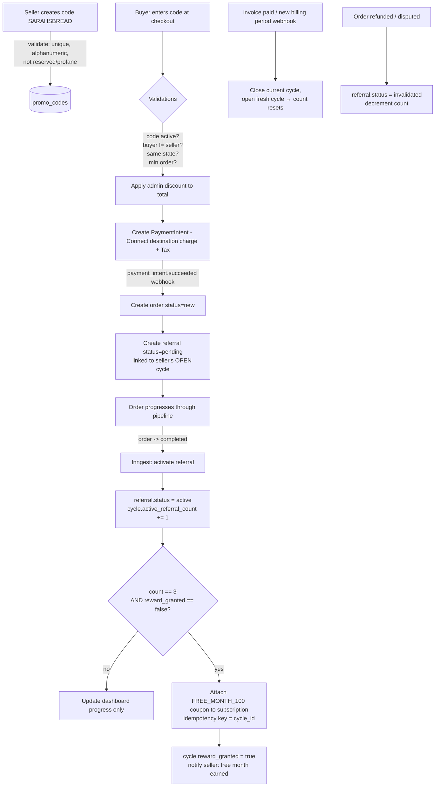

# Harvest Local — Technical Architecture & Build Plan

> A hyper-local, peer-to-peer marketplace: a Zillow-style map for farmers, artisans, and makers.
> This document is written to double as build context. Drop it in your repo as `ARCHITECTURE.md` and
> reference it from `CLAUDE.md` so Claude Code has the full picture on every session.

---

## 0. Architecture at a Glance

```
                          ┌─────────────────────────────────────────┐
                          │              Next.js (App Router)         │
   Buyers / Sellers ──▶   │   React UI · Server Actions · API routes  │
      Admins              │   Mapbox GL · TanStack Query · Tailwind   │
                          └───────────────┬───────────────────────────┘
                                          │
             ┌────────────────────────────┼───────────────────────────────┐
             │                            │                                │
     ┌───────▼────────┐        ┌──────────▼──────────┐          ┌──────────▼─────────┐
     │  Supabase       │        │  Stripe             │          │  Inngest           │
     │  Postgres+PostGIS│       │  Connect · Billing  │          │  (durable jobs &   │
     │  Auth · Realtime │       │  Tax · Webhooks     │          │  event workflows)  │
     │  Storage         │        └─────────────────────┘          └────────────────────┘
     └───────┬─────────┘
             │
   ┌─────────┼──────────────────────────┐
   │         │                          │
┌──▼───┐  ┌──▼────────┐            ┌─────▼──────┐
│Resend│  │Twilio SMS │            │Routing API │
│Email │  │           │            │(Mapbox/GMaps)│
└──────┘  └───────────┘            └────────────┘
```

The design goal is **few moving parts**. A Next.js + Supabase + Stripe core covers ~80% of the spec
natively (auth, geospatial queries, realtime messaging, file storage, payments), which is also the
stack Claude Code is most fluent in. Inngest handles the time-based and multi-step logic (referral
evaluation, license-expiry checks, notification fan-out) that shouldn't live in request handlers.

---

## 1. Tech Stack

### 1.1 Application framework & language
- **Next.js (App Router) + TypeScript** end-to-end. Server Actions and Route Handlers give you a
  backend without a separate service; React Server Components keep the map/gallery fast.
- **Tailwind CSS + shadcn/ui** for UI velocity and a consistent admin/seller/buyer design system.
- **TanStack Query** for client-side data fetching, caching, and optimistic updates (order pipeline,
  messaging).
- **Zod** for shared validation schemas (checkout, promo codes, onboarding) reused on client + server.

### 1.2 Mapping (the "Zillow-style" experience)
- **Mapbox GL JS** as the primary map. Reasons: vector tiles, GPU clustering for hundreds of pins,
  custom marker styling, bounding-box viewport queries, and a generous map-load free tier.
- **Mapbox Geocoding API** to convert seller/buyer addresses → lat/lng at onboarding and checkout.
- **Mapbox Directions / Matrix API** for the **dynamic delivery mileage fee** (driving distance +
  duration between seller and buyer). *Alternative:* Google Maps Platform (Places + Distance Matrix)
  if you prefer their routing accuracy; keep the routing provider behind a small interface so it's
  swappable.
- Store geometry in Postgres via **PostGIS** (`geography(Point,4326)`), so "sellers within this map
  viewport" and "within N miles" are single indexed SQL queries rather than app-side math.

### 1.3 Complex filtering (Category / Sub-Category / Tags + geo)
- **Postgres + PostGIS** is the workhorse. It handles the whole matrix in one query:
  - Category / sub-category → indexed FK columns.
  - Tags → many-to-many join, or a `text[]` column with a **GIN index** for `&&` (overlap) filters.
  - Geo → **GiST index** on the geography column for viewport/radius filtering.
  - Full-text search on titles/descriptions → Postgres `tsvector` + GIN.
- **When to add a dedicated search engine:** if faceted search, typo tolerance, and instant-search
  ranking become a bottleneck (usually 5-figure listing counts), bolt on **Typesense** or
  **Meilisearch** (self-host friendly) or **Algolia** (managed). Keep Postgres as source of truth and
  sync into the search index via Inngest. Don't start here — Postgres is enough for MVP and beyond.

### 1.4 Real-time messaging
- **Supabase Realtime** (Postgres logical replication over WebSockets). You write a `messages` row;
  subscribed clients receive it live. You get presence and read receipts without standing up your own
  socket server.
- Row-Level Security (RLS) scopes each subscription so a user only receives messages from their own
  conversations.
- *Alternatives if you outgrow it:* **Ably** or **Pusher** (managed pub/sub), or a **Socket.io**
  service. For this product's volume, Supabase Realtime is the right first choice.

### 1.5 Payments — Stripe Connect + Billing + Tax
Three Stripe products working together; keep them clearly separated in your head:

| Stripe product | What it does here | Key objects |
|---|---|---|
| **Connect (Accounts v2)** | Buyers pay sellers for goods; you onboard sellers with Stripe-hosted KYC and route payouts. | `v2.core.account`, `v2.core.account_link`, `PaymentIntent` (destination charge, `on_behalf_of`), `Transfer` |
| **Billing** | The **$20/mo seller subscription**, the **90-day trial**, and the **100%-off free month** reward. | `Customer`, `Subscription` (`trial_period_days: 90`), `Price`, `Coupon`, `Invoice` |
| **Tax** | Auto-calculates & collects **local sales tax** by product category + buyer jurisdiction. | Product `tax_code`, `automatic_tax` on PaymentIntents/Invoices |

Notes and gotchas:
- **Connect account API:** **Accounts v2** (`POST /v2/core/accounts`). The v1 `type: 'express' |
  'standard' | 'custom'` path is deprecated and rejected for new integrations. We use
  `dashboard: 'express'` (Stripe hosts onboarding/KYC + a lightweight dashboard) with
  `defaults.responsibilities.fees_collector` / `losses_collector` both `application`. Onboarding is
  the `v2.core.account_link` hosted flow. Read go-live readiness from **v2 capability status**
  (`configuration.merchant.capabilities.card_payments.status`,
  `configuration.recipient.capabilities.stripe_balance.stripe_transfers.status`), never the
  deprecated `charges_enabled` / `payouts_enabled` / `details_submitted` fields.
- **Account configuration:** each seller account gets **both** v2 configurations —
  `recipient` (`stripe_balance.stripe_transfers`, to receive destination-charge transfers) **and**
  `merchant` (`card_payments`, to be merchant of record).
- **Charge model:** **destination charges** with **`on_behalf_of` = the seller's connected account**.
  Funds still flow platform→seller via `transfer_data.destination`, but `on_behalf_of` makes the
  **connected seller account the merchant of record** — so Stripe Tax is calculated and settled
  against the *seller's* registrations, matching cottage-food law where the seller is the food
  seller. `application_fee_amount` can be `0` now (revenue is the subscription) and turned on later.
- **Merchant of record = the connected seller account** (decided; overrides the earlier
  platform-MoR framing). This dictates that the seller's tax registrations apply. Confirm the current
  Stripe Tax + Connect + `on_behalf_of` behaviour in Stripe's docs before Phase 2 launch.
- **Everything is webhook-driven and idempotent.** Never mutate subscription/order state from the
  browser's "success" redirect alone; treat webhooks as the source of truth.

### 1.6 Supporting services
- **Auth:** Supabase Auth (email/OTP + social), with `role` (buyer / seller / admin) claims driving
  RLS and route guards.
- **Background jobs & scheduled workflows:** **Inngest** — event-driven, durable, retriable, and very
  Claude-Code-friendly (functions are just typed TS). Handles: referral activation/evaluation, free-
  month granting, trial-ending reminders, license-expiry scans, revenue-cap checks, notification fan-
  out, search-index sync. *Simpler alternative for pure cron:* Supabase `pg_cron` + Edge Functions.
- **Transactional email:** **Resend** (+ **React Email** for templates).
- **SMS:** **Twilio** (order-status texts, license-expiry alerts).
- **File storage:** Supabase Storage (product images, license/ID documents — keep docs in a private
  bucket with signed URLs).
- **Hosting:** **Vercel** (Next.js) + **Supabase** (managed Postgres). Both have first-class local dev.
- **Observability:** Sentry (errors) + Stripe's own event log + Inngest's run history.

---

## 2. Database Schema

Postgres + PostGIS (Supabase flavor). IDs are `uuid`. `timestamptz` throughout. Stripe objects are
**mirrored** locally — Stripe is the source of truth for money, your DB is a fast, queryable cache kept
in sync by webhooks. RLS policies are omitted here for brevity but are required on every table.

### 2.1 Identity, storefronts & geo

```sql
-- Mirrors Supabase auth.users
create table profiles (
  id            uuid primary key references auth.users(id) on delete cascade,
  role          text not null default 'buyer' check (role in ('buyer','seller','admin')),
  display_name  text not null,
  phone         text,
  home_state    char(2),               -- snapshot of the user's state for geofencing
  avatar_url    text,
  created_at    timestamptz not null default now()
);

create table addresses (
  id           uuid primary key default gen_random_uuid(),
  user_id      uuid not null references profiles(id) on delete cascade,
  line1        text not null,
  line2        text,
  city         text not null,
  state        char(2) not null,
  postal_code  text not null,
  country      char(2) not null default 'US',
  location     geography(Point,4326),  -- geocoded; GiST-indexed below
  is_default   boolean not null default false,
  created_at   timestamptz not null default now()
);
create index addresses_geo_gix on addresses using gist (location);

create table seller_profiles (
  id                    uuid primary key default gen_random_uuid(),
  profile_id            uuid not null unique references profiles(id) on delete cascade,
  business_name         text not null,
  storefront_slug       text not null unique,
  bio                   text,
  home_state            char(2) not null,          -- authoritative selling state
  pickup_address_id     uuid references addresses(id),
  is_paused             boolean not null default false,  -- flipped by revenue caps / admin
  pause_reason          text,                            -- 'revenue_cap' | 'license_expired' | 'admin'
  delivery_enabled      boolean not null default false,
  delivery_radius_miles numeric(5,1),
  delivery_base_fee     numeric(8,2) default 0,
  delivery_per_mile_fee numeric(8,2) default 0,
  avg_rating            numeric(2,1),
  created_at            timestamptz not null default now()
);
```

### 2.2 Catalog & filtering

```sql
create table categories (
  id         uuid primary key default gen_random_uuid(),
  name       text not null,
  slug       text not null unique,
  parent_id  uuid references categories(id),   -- self-ref: null = category, set = sub-category
  tax_code   text                              -- default Stripe tax code for the category
);

create table tags (
  id   uuid primary key default gen_random_uuid(),
  name text not null,
  slug text not null unique
);

create table products (
  id                 uuid primary key default gen_random_uuid(),
  seller_id          uuid not null references seller_profiles(id) on delete cascade,
  title              text not null,
  description        text,
  price              numeric(10,2) not null,
  category_id        uuid not null references categories(id),
  subcategory_id     uuid references categories(id),
  status             text not null default 'draft'
                       check (status in ('draft','active','sold_out','archived')),
  quantity_available int,
  images             jsonb not null default '[]',
  tax_code           text,               -- overrides category tax_code when set
  search_tsv         tsvector,           -- maintained by trigger for full-text
  created_at         timestamptz not null default now()
);
create index products_category_ix   on products (category_id, subcategory_id, status);
create index products_search_gix    on products using gin (search_tsv);

create table product_tags (
  product_id uuid references products(id) on delete cascade,
  tag_id     uuid references tags(id) on delete cascade,
  primary key (product_id, tag_id)
);
```

### 2.3 Subscriptions (Stripe Billing mirror)  ⭐ requested

```sql
create table subscriptions (
  id                     uuid primary key default gen_random_uuid(),
  seller_id              uuid not null unique references seller_profiles(id) on delete cascade,
  stripe_customer_id     text not null,
  stripe_subscription_id text unique,
  stripe_price_id        text,                         -- the $20/mo price
  status                 text not null                 -- mirror of Stripe status
                           check (status in ('trialing','active','past_due',
                                             'canceled','unpaid','incomplete','incomplete_expired')),
  trial_start            timestamptz,
  trial_end              timestamptz,                  -- ~90 days out for early adopters
  current_period_start   timestamptz,
  current_period_end     timestamptz,
  cancel_at_period_end   boolean not null default false,
  created_at             timestamptz not null default now(),
  updated_at             timestamptz not null default now()
);
create index subscriptions_status_ix on subscriptions (status);
```

> The 90-day trial is set once at creation: create the Stripe Subscription with
> `trial_period_days: 90` (or a `trial_end` timestamp) for early-adopter sellers. Card can be collected
> up front or deferred; if deferred, listen for `customer.subscription.trial_will_end` to prompt.

### 2.4 Referral engine  ⭐ requested

```sql
-- A seller's custom, human-chosen code (e.g. "SARAHSBREAD")
create table promo_codes (
  id          uuid primary key default gen_random_uuid(),
  seller_id   uuid not null references seller_profiles(id) on delete cascade,
  code        text not null unique,          -- store UPPERCASE; validated alphanumeric
  is_active   boolean not null default true,
  times_used  int not null default 0,
  created_at  timestamptz not null default now()
);
create unique index promo_codes_code_ux on promo_codes (upper(code));

-- One billing-cycle "bucket" per seller; referral counting resets each cycle
create table referral_cycles (
  id                    uuid primary key default gen_random_uuid(),
  seller_id             uuid not null references seller_profiles(id) on delete cascade,
  subscription_id       uuid not null references subscriptions(id) on delete cascade,
  period_start          timestamptz not null,
  period_end            timestamptz not null,
  active_referral_count int not null default 0,
  reward_granted        boolean not null default false,
  reward_stripe_coupon_id text,              -- the 100%-off coupon applied to next invoice
  created_at            timestamptz not null default now()
);
create index referral_cycles_open_ix on referral_cycles (seller_id, period_end);

-- One row per buyer's use of a code
create table referrals (
  id               uuid primary key default gen_random_uuid(),
  promo_code_id    uuid not null references promo_codes(id),
  seller_id        uuid not null references seller_profiles(id),   -- denormalized for fast counting
  buyer_id         uuid not null references profiles(id),
  order_id         uuid not null references orders(id),
  cycle_id         uuid references referral_cycles(id),            -- which bucket it counts toward
  status           text not null default 'pending'
                     check (status in ('pending','active','invalidated')),
  discount_amount  numeric(10,2) not null,                        -- what the buyer received
  activated_at     timestamptz,
  invalidated_at   timestamptz,
  created_at       timestamptz not null default now()
);
-- A buyer can't farm the same seller's code repeatedly for credit
create unique index referrals_one_per_buyer_seller_cycle
  on referrals (seller_id, buyer_id, cycle_id) where status <> 'invalidated';
```

The buyer-facing discount amount/percent is **admin-configured globally**, stored in `platform_settings`
(2.9), so a single number governs every code. The seller reward (free month) is fixed business logic:
3 active referrals → 100% off next invoice.

### 2.5 Orders & the status pipeline  ⭐ requested

```sql
create table orders (
  id                     uuid primary key default gen_random_uuid(),
  buyer_id               uuid not null references profiles(id),
  seller_id              uuid not null references seller_profiles(id),
  status                 text not null default 'new'
                           check (status in ('new','preparing','ready',
                                             'out_for_delivery','completed','cancelled','disputed')),
  fulfillment_type       text not null check (fulfillment_type in ('pickup','delivery')),
  -- Money (all captured as snapshots at checkout)
  subtotal               numeric(10,2) not null,
  discount_total         numeric(10,2) not null default 0,
  delivery_fee           numeric(10,2) not null default 0,
  tax_total              numeric(10,2) not null default 0,
  total                  numeric(10,2) not null,
  -- Compliance snapshots (frozen at order time)
  buyer_state            char(2) not null,
  seller_state           char(2) not null,
  -- Links
  promo_code_id          uuid references promo_codes(id),
  delivery_address_id    uuid references addresses(id),
  delivery_distance_miles numeric(6,1),
  stripe_payment_intent_id text,
  created_at             timestamptz not null default now(),
  updated_at             timestamptz not null default now(),
  -- Geofence guarantee at the database level:
  constraint same_state_only check (buyer_state = seller_state)
);

create table order_items (
  id             uuid primary key default gen_random_uuid(),
  order_id       uuid not null references orders(id) on delete cascade,
  product_id     uuid not null references products(id),
  quantity       int not null check (quantity > 0),
  unit_price     numeric(10,2) not null,       -- snapshot
  line_total     numeric(10,2) not null,
  category_snapshot text,
  tax_code       text
);

-- Audit trail + the trigger point for notifications
create table order_status_history (
  id          uuid primary key default gen_random_uuid(),
  order_id    uuid not null references orders(id) on delete cascade,
  from_status text,
  to_status   text not null,
  changed_by  uuid references profiles(id),    -- null = system
  note        text,
  created_at  timestamptz not null default now()
);
```

> The `same_state_only` CHECK constraint makes cross-state transactions **impossible at the data
> layer** — even a bug in application code can't write one. That's the right place for a legal
> guardrail this critical.

### 2.6 Messaging

```sql
create table conversations (
  id             uuid primary key default gen_random_uuid(),
  buyer_id       uuid not null references profiles(id),
  seller_id      uuid not null references seller_profiles(id),
  order_id       uuid references orders(id),    -- nullable: can inquire before ordering
  last_message_at timestamptz,
  created_at     timestamptz not null default now(),
  unique (buyer_id, seller_id, order_id)
);

create table messages (
  id              uuid primary key default gen_random_uuid(),
  conversation_id uuid not null references conversations(id) on delete cascade,
  sender_id       uuid not null references profiles(id),
  body            text not null,
  read_at         timestamptz,
  created_at      timestamptz not null default now()
);
create index messages_convo_ix on messages (conversation_id, created_at);
```

### 2.7 Trust — reviews & reports

```sql
create table reviews (
  id          uuid primary key default gen_random_uuid(),
  order_id    uuid not null unique references orders(id),   -- one review per completed order
  reviewer_id uuid not null references profiles(id),        -- must be the order's buyer
  seller_id   uuid not null references seller_profiles(id),
  rating      int not null check (rating between 1 and 5),
  body        text,
  created_at  timestamptz not null default now()
);

create table reports (
  id             uuid primary key default gen_random_uuid(),
  order_id       uuid not null references orders(id),
  reporter_id    uuid not null references profiles(id),
  reason         text not null,
  description    text,
  status         text not null default 'open'
                   check (status in ('open','investigating','resolved','refunded')),
  resolution_note text,
  resolved_by    uuid references profiles(id),
  resolved_at    timestamptz,
  created_at     timestamptz not null default now()
);

create table refunds (
  id               uuid primary key default gen_random_uuid(),
  order_id         uuid not null references orders(id),
  report_id        uuid references reports(id),
  stripe_refund_id text not null,
  amount           numeric(10,2) not null,
  reason           text,
  initiated_by     uuid references profiles(id),
  created_at       timestamptz not null default now()
);
```

> **Verified-buyer enforcement:** a review is only insertable when a row exists in `orders` where
> `order.buyer_id = reviewer_id` and `order.status = 'completed'`. Enforce this in an RLS policy /
> `BEFORE INSERT` trigger, not just app code.

### 2.8 Compliance — licenses & revenue caps

```sql
create table seller_licenses (
  id                  uuid primary key default gen_random_uuid(),
  seller_id           uuid not null references seller_profiles(id) on delete cascade,
  license_type        text not null,        -- 'cottage_food', 'business_id', 'food_handler', ...
  license_number      text,
  issuing_state       char(2) not null,
  issued_date         date,
  expiration_date     date not null,
  document_url        text,                 -- private Supabase Storage object
  verification_status text not null default 'pending'
                        check (verification_status in ('pending','verified','rejected','expired')),
  created_at          timestamptz not null default now()
);
create index seller_licenses_expiry_ix on seller_licenses (expiration_date, verification_status);

-- Reference data: per-state cottage-food rules
create table state_cottage_food_rules (
  state_code        char(2) primary key,
  revenue_cap       numeric(12,2),          -- annual gross cap; null = no cap
  requires_license  boolean not null default false,
  allowed_categories jsonb,
  notes             text
);

-- Rolling gross-revenue tally used to auto-pause at the cap
create table seller_revenue_tracking (
  id            uuid primary key default gen_random_uuid(),
  seller_id     uuid not null references seller_profiles(id) on delete cascade,
  state         char(2) not null,
  period_year   int not null,
  gross_revenue numeric(12,2) not null default 0,
  cap_amount    numeric(12,2),
  is_over_cap   boolean not null default false,
  updated_at    timestamptz not null default now(),
  unique (seller_id, state, period_year)
);
```

### 2.9 Platform settings & notifications

```sql
-- Single-row-per-key config incl. the launch-phasing toggle & buyer discount value
create table platform_settings (
  key         text primary key,     -- 'access_mode', 'buyer_referral_discount', ...
  value       jsonb not null,       -- 'access_mode' -> {"mode":"sellers_only"} | {"mode":"public"}
  updated_by  uuid references profiles(id),
  updated_at  timestamptz not null default now()
);

create table notifications (
  id         uuid primary key default gen_random_uuid(),
  user_id    uuid not null references profiles(id) on delete cascade,
  channel    text not null check (channel in ('email','sms','in_app')),
  template   text not null,          -- 'order_status_changed', 'license_expiring', ...
  payload    jsonb not null default '{}',
  status     text not null default 'queued'
               check (status in ('queued','sent','failed')),
  sent_at    timestamptz,
  created_at timestamptz not null default now()
);
```

---

## 3. Referral Engine Architecture

This is the growth flywheel, so it's worth designing precisely. It spans **buyer checkout (a Connect
payment)** and **seller reward (a Billing discount)** — two different Stripe surfaces.

### 3.1 Stripe object mapping
- **Buyer discount:** compute it yourself in the order total (admin-set % from `platform_settings`)
  and charge the discounted `PaymentIntent`. You don't need Stripe Promotion Codes here because the
  buyer isn't checking out a subscription — the code is a *marketplace* discount you own end-to-end.
  This keeps attribution (which seller earned the referral) entirely in your DB.
- **Seller reward (free month):** one reusable Stripe **Coupon** `FREE_MONTH_100` (`percent_off: 100`,
  `duration: once`). When earned, attach it to the seller's Subscription so the **next invoice renders
  $0**. Stripe handles proration and the actual $0 charge.

### 3.2 End-to-end flow



### 3.3 Definitions that prevent disputes later
- **"Active" referral** = the qualifying order reached `completed` (a *verified transaction*), and it
  is attributed to the seller's **currently open** `referral_cycle`.
- **"Billing cycle"** = the seller's Stripe subscription period. A referral counts toward whichever
  cycle is open at the moment it *activates* (order completes), not when the code was used.
- **Reset:** on `invoice.paid` (or `customer.subscription.updated` with a new period), close the open
  cycle and open a new one. Counting restarts at 0. The reward is grantable **once per cycle**.

### 3.4 Correctness & anti-abuse (design for these from day one)
- **Idempotency:** every Stripe write uses an idempotency key derived from a stable local ID
  (`cycle_id` for the reward grant). The `count == 3` check and the grant happen in **one DB
  transaction** with `reward_granted` guarding against double-grant under concurrency.
- **Self-referral block:** buyer's `profile_id` ≠ code's `seller_id`; also block a seller's own alt
  accounts via device/payment-method signals if abuse appears.
- **Farming block:** the partial unique index (2.4) means one buyer counts **once per seller per
  cycle**. Consider a minimum order value before a referral is eligible.
- **Clawback policy (decide explicitly):** when a qualifying order is refunded/disputed, set the
  referral `invalidated` and decrement the count. If the free month was *already* granted and the count
  now drops below 3 — recommended default is **do not revoke** an issued free month (bad seller
  experience, small $), but **flag** the seller for admin review to catch coordinated fraud.
- **Trial interaction:** while a seller is in the 90-day trial, referral progress still accrues; the
  100%-off coupon simply applies to the first *paid* invoice after the trial.

### 3.5 Seller dashboard "Referral Progress"
Read straight off the open `referral_cycle`: `active_referral_count / 3`, plus a list of contributing
orders and the projected free-month date (the cycle's `period_end`). Because it's a single indexed
row, the dashboard widget is a cheap query.

---

## 4. Compliance Guardrails (CRITICAL path)

These are legal, not just product, requirements — implement them defensively (DB constraints + server
checks + jobs), never client-side alone.

- **Geofencing (cross-state prohibition):** enforced in three layers — (1) the `same_state_only` CHECK
  constraint on `orders`, (2) a checkout server-side guard comparing buyer vs. seller state, (3) the
  map/search hides out-of-state sellers for a given buyer by default.
- **Revenue caps:** on every `order -> completed`, an Inngest function increments
  `seller_revenue_tracking.gross_revenue`. If it crosses the state's `revenue_cap`, set
  `seller_profiles.is_paused = true` with `pause_reason = 'revenue_cap'` and notify the seller + admin.
  Paused storefronts stop accepting checkouts (server guard) and drop off the map.
- **License / ID expiration:** a daily Inngest cron scans `seller_licenses.expiration_date`. Send
  reminders at T-30 / T-7 / T-1 days; at expiry, mark `verification_status='expired'` and pause the
  storefront until renewed.
- **Tax automation:** enable `automatic_tax` on Connect PaymentIntents and set each product's Stripe
  `tax_code` (defaulting from its category). Stripe Tax computes local sales tax by buyer jurisdiction.
  **Merchant of record is the connected seller account** (§1.5): the destination-charge PaymentIntent
  sets `on_behalf_of` to the seller, so Stripe Tax applies against the *seller's* registrations. The
  seller must have an active Stripe Tax registration in their selling state or Stripe silently
  collects nothing.

---

## 5. Development Phases (MVP → Full Launch)

Phases are sequenced so each ends with something shippable. They overlap in practice; treat them as
milestones, not walls.

### Phase 1 — Foundation & Seller Onboarding *(the MVP)*
**Goal:** early-adopter sellers can sign up, list, and subscribe; the map exists.
- Auth + roles (buyer/seller/admin), profiles, RLS baseline.
- **Launch phasing toggle** in `platform_settings` → "Sellers Only" gate for the first 30 days
  (build it here since early adopters onboard first).
- Seller onboarding: **Stripe Connect Express** KYC + **Stripe Billing subscription with the 90-day
  trial**.
- Product CRUD; categories / sub-categories / tags.
- **Mapbox** map + gallery view with Category / Sub-Category / Tag filters (PostGIS-backed).
- Deploy to Vercel + Supabase; wire Stripe webhooks + Inngest skeleton.

### Phase 2 — Transactions & Compliance Guardrails
**Goal:** money moves, legally.
- Buyer checkout → **Connect destination charge** + **Stripe Tax**.
- **Geofencing** (constraint + guards), **revenue-cap** tracking/auto-pause, **license-expiry**
  tracking + reminders.
- Orders + **status pipeline** (New → Preparing → Ready → Completed) with `order_status_history`.
- Seller order-management board.

### Phase 3 — Growth Engine & Fulfillment
**Goal:** the flywheel and delivery.
- **Referral engine** (Section 3): custom promo codes, cycle tracking, 3→free-month automation.
- Seller dashboard analytics: **Referral Progress**, AOV, conversion rate, views.
- **Dynamic fulfillment:** pickup vs. delivery; **routing API** mileage-based fees.
- **Notifications:** Resend email + Twilio SMS on every status change (driven by
  `order_status_history` → Inngest fan-out).

### Phase 4 — Trust, Communication & Community
**Goal:** buyers trust the marketplace.
- **In-app messaging** (Supabase Realtime, RLS-scoped).
- **Reviews** — verified-buyer-only, one per completed order.
- **Issue/Report** system for disputed orders.

### Phase 5 — Admin, Disputes & Public Launch
**Goal:** operate at scale and open the doors.
- **Superadmin dashboard:** dispute/refund queue with **1-click Stripe refund**; flip `access_mode`
  to public.
- **Platform analytics:** GMV, total revenue, subscription revenue, active users.
- Harden: rate limits, monitoring/alerting, load test, optional search engine (Typesense/Algolia) if
  filtering needs it. Remove the "Sellers Only" restriction → full launch.

---

## 6. Building This With Claude Code

### 6.1 Install & prerequisites (current as of Sep 2026)
- **Recommended: native installer, zero dependencies (no Node.js needed for the CLI itself).**
  - macOS / Linux: `curl -fsSL https://claude.ai/install.sh | bash`
  - Windows (PowerShell): `irm https://claude.ai/install.ps1 | iex`
  - Alternatives: `brew install --cask claude-code`, `winget install Anthropic.ClaudeCode`, or the
    **Claude Desktop app** (GUI, no terminal).
- **npm method (optional):** `npm install -g @anthropic-ai/claude-code` — now expects **Node.js 22+**.
- **Still install Node.js LTS anyway** — you need it to run this stack locally (Next.js), and MCP
  servers launched via `npx` (see 6.4) depend on it.
- **Account:** a paid plan (Claude **Pro**, **Max**, **Team**, or **Enterprise**) or a Console API key.
- Verify with `claude --version`, then run `claude doctor` for a config/auth check.
- Platforms: macOS 13+, Windows 10 1809+ (WSL2 recommended), Ubuntu 20.04+/Debian 10+.

*(Product details change; confirm at the official Claude Code setup docs before you start.)*

### 6.2 Also install (for this project specifically)
- **Node.js LTS** + a package manager (pnpm recommended), **Git**, and the **Supabase CLI**
  (`supabase start` for local Postgres + Auth + Storage).
- **Stripe CLI** — essential for `stripe listen --forward-to localhost:3000/api/webhooks/stripe`
  during development so you can build the webhook-driven logic without deploying.
- Accounts/keys: Supabase, Stripe (test mode), Mapbox, Resend, Twilio, Inngest.

**Deployed Stripe webhook endpoints** (`stripe listen` forwards everything, so this list only
matters once there's a real endpoint at `https://<domain>/api/webhooks/stripe`). The handler's
signature check tries both secrets, so events can sit on either endpoint — the split below is the
tidy default:

| Endpoint | Secret env var | Enabled events |
|---|---|---|
| Account (platform) | `STRIPE_WEBHOOK_SECRET` | `checkout.session.completed`, `checkout.session.async_payment_succeeded`, `checkout.session.async_payment_failed`, `checkout.session.expired`, `charge.refunded`, `charge.dispute.created`, `customer.subscription.created`, `customer.subscription.updated`, `customer.subscription.deleted`, `customer.subscription.paused`, `customer.subscription.resumed`, `invoice.paid` |
| Connect (connected accounts) | `STRIPE_CONNECT_WEBHOOK_SECRET` | `account.updated` |

Keep this in sync with the `switch` in `src/app/api/webhooks/stripe/route.ts`.

### 6.3 Set Claude Code up for success
The single biggest lever is a strong **`CLAUDE.md`** at the repo root. Claude Code reads it every
session. Put in it:
1. **A pointer to this file:** "Architecture and schema live in `ARCHITECTURE.md` — treat it as the
   source of truth."
2. **Guardrails as rules**, e.g.:
   - "Never write an order that crosses state lines; the `same_state_only` constraint must stay."
   - "All Stripe state changes come from webhooks and must be idempotent — never trust the client
     redirect."
   - "Reviews are insertable only for the buyer of a `completed` order."
   - "Money math happens server-side; the client never computes totals or tax."
3. **Conventions:** TypeScript strict, Zod at every boundary, RLS on every table, feature-folder
   structure, test command, lint command.
4. **Commands** Claude can run: `pnpm dev`, `pnpm test`, `supabase db reset`, `stripe listen ...`.

Then work **phase by phase** (Section 5). Give Claude one milestone at a time, let it plan, review its
diffs, and keep migrations small. Start it on something low-risk (a component, a query) before letting
it touch billing, auth, or migrations.

### 6.4 MCP servers worth connecting
Claude Code can talk to external systems via MCP, which tightens the loop on this stack:
- **Supabase MCP** — inspect schema, run queries, manage migrations from inside Claude Code.
- **Stripe MCP** — explore test-mode objects (customers, subscriptions, coupons) while building
  Billing/Connect flows.
- **GitHub MCP** — issues/PRs if you want Claude managing the workflow.
- Add local stdio servers with, e.g.,
  `claude mcp add --transport stdio supabase -- npx -y @supabase/mcp-server` (this is why Node/npx is
  worth having on PATH).

### 6.5 A sensible first prompt to Claude Code
> "Read `ARCHITECTURE.md`. Scaffold Phase 1: a Next.js + TypeScript app with Supabase (Auth, Postgres,
> Storage) and Tailwind + shadcn/ui. Create the Phase-1 tables from the schema as Supabase migrations
> with RLS. Build seller onboarding with Stripe Connect Express and a Billing subscription that starts
> a 90-day trial. Add the Mapbox map + gallery view with category/sub-category/tag filters. Stop after
> onboarding + listings work end-to-end in test mode, and show me the migration and webhook files for
> review."

---

## Appendix — Key Design Decisions (quick reference)
- **Stripe is the source of truth for money; the DB mirrors it via idempotent webhooks.**
- **Legal guardrails live at the data layer** (constraints) *and* the server layer, never only client-
  side.
- **Buyer referral discount = your own order math; seller free-month reward = a Stripe 100% coupon.**
- **Referral counting is per open billing cycle, resets on `invoice.paid`, grants once per cycle.**
- **Start on Postgres + PostGIS for all filtering; add a search engine only when it hurts.**
- **Inngest owns anything time-based or multi-step** (activation, caps, expiries, notifications).
